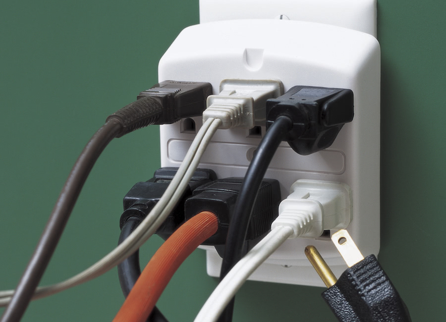

---?image=assets/img/wp-accessibility-workshop.jpg&size=cover&opacity=55
@snap[north span-100 text-05]
# WordPress Accessibility Workshop
@snapend

@snap[midpoint]
Robert Jolly
@snapend

---
@title[About Knowbility & W3C]

@snap[north vh]
## Knowbility is a member organization of the W3C.
@snapend

@snap[midpoint]

@snapend

---?color=#0D0823
@title[The Day at a Glance]

@snap[north span-100]
## @size[2.4rem](Today’s Agenda)
@snapend

@snap[midpoint span-90]
@ol
- Prerequisites and WordPress defaults
- WP Accessibility for Developers
- WP Accessibility for Content Authors
@olend
@snapend

---?color=#0D0823
@title[Topics, 1 of 4]

@snap[north span-100]
## @size[2.4rem](First Topics for Developers)
@snapend

@snap[midpoint span-90 widen]
@ul[text-white text-08]
- Prerequisites
  - What is Accessibility?
  - Accessibility Principles
  - WCAG
  - General WordPress knowledge
  - Familiarity & Comfort with F.E.D.
- WordPress and Accessibility
  - [WordPress Core Team’s A11y Commitment](https://make.wordpress.org/core/handbook/best-practices/coding-standards/accessibility-coding-standards/)
  - A tour of WordPress defaults
@ulend
@snapend

---?color=#ECECEC

@snap[north span-100 text-06]
## Pause for a moment...
@snapend

@snap[midpoint span-80]
Do you have any questions so far? 
@snapend

---?color=#0D0823
@title[Topics, 2 of 4]

@snap[north span-100]
## @size[2.4rem](Devs - Common WP Accessibility Issues)
@snapend

@snap[midpoint span-90 widen]
@ul[text-white text-08]
- Lack of keyboard support
  - Menus
  - Links/Buttons
  - Accordions
  - Carousels 🙀
@ulend
@snapend

---?color=#0D0823
@title[Topics, 3 of 4]

@snap[north span-100]
## @size[2.4rem](Devs - Common WP Accessibility Issues)
@snapend

@snap[midpoint span-90 widen]
@ul[text-white text-08]
- No visible focus
- Form label issues
- Form validation and error handling
- No skip links
@ulend
@snapend

---?color=#0D0823
@title[Topics, 4 of 4]

@snap[north span-100]
## @size[2.4rem](Devs - Common WP Accessibility Issues)
@snapend

@snap[midpoint span-90 widen]
@ul[text-white text-08]
- Low contrast (text and non-text)
- Alt text issues 
- Link text problems
- Lack of landmark regions
- Document & heading structure
- Language of page & parts
- Multimedia
@ulend
@snapend

---?color=#ECECEC
@title[Customizing WordPress]

@snap[midpoint span-100 text-06]
## Basic WordPress Customization for Accessibility
@snapend

---?color=#ECECEC

@snap[north span-100 text-06]
### Accessibility Ready Themes
@snapend

@snap[midpoint span-75]
[@img[Accessibility Ready Themes](assets/img/themes-a-r.jpg)](https://wordpress.org/themes/tags/accessibility-ready/)
@snapend

---?color=#0D0823

@snap[north span-100 text-06]
### Theme Reviews for Accessibility 
@snapend

@snap[midpoint span-75]
[@img[Accessibility Theme Review Handbook - opens in new window](assets/img/themes-a-r-review.jpg)](https://make.wordpress.org/themes/handbook/review/accessibility/required/)
@snapend

---?color=#ECECEC

@snap[north span-100 text-06]
### Premium/Commercial Themes
@snapend

@snap[midpoint span-80]
@ul
- No formal reviews - buyer beware
- Child themes - always a good possibility
@ulend
@snapend

---?color=#0D0823

@snap[north span-100 text-06]
### Plugins for (or with) Accessibility
@snapend

@snap[midpoint span-50]

@snapend

---?color=#ECECEC
@title[A note about accessibility plugins]

@snap[midpoint span-100 text-04]
## Note: We should not need most of these plugins!
@snapend

---?color=#ECECEC

@snap[north span-100 text-06]
## WP Accessibility
@snapend

@snap[midpoint span-75]
[@img[WP Accessibility plugin by Joe Dolson - opens in new window](assets/img/plugin-wp-accessibility.jpg)](https://wordpress.org/plugins/wp-accessibility/)
@snapend

---?color=#ECECEC

@snap[north span-100 text-06]
## More plugins
@snapend

@snap[midpoint span-80 text-08]
@ul
- [WCAG 2.0 Form Fields](https://wordpress.org/plugins/gravity-forms-wcag-20-form-fields/) for Gravity Forms
- [Contact Form 7: Accessible Defaults](https://wordpress.org/plugins/contact-form-7-accessible-defaults/) by Joe Dolson 
- [Genesis Accessible](https://wordpress.org/plugins/genesis-accessible/) by Rian Rietveld
- [Divi Accessibility](https://wordpress.org/plugins/accessible-divi/) by CampusPress
- [My Calendar](https://wordpress.org/plugins/my-calendar/) by Joe Dolson
- [Soliloquy Slider](https://wordpress.org/plugins/soliloquy-lite/)
- [NextGen Gallery](https://wordpress.org/plugins/nextgen-gallery/) 
@ulend
@snapend

---?color=#0D0823

@snap[north span-100 text-06]
## Pause a bit
@snapend

@snap[midpoint span-80]
Questions? Are there any plugins you like, dislike, or want to discuss?
@snapend

---?color=#ECECEC

@snap[north span-100 text-06]
## Advanced Theme Customizations
@snapend

@snap[midpoint span-80]
@ul
- [Child Themes](https://developer.wordpress.org/themes/advanced-topics/child-themes/)
- [Custom “Parent” Themes](https://developer.wordpress.org/themes/getting-started/what-is-a-theme/)
  - [Accessibility-Ready Theme Review](https://make.wordpress.org/themes/handbook/review/accessibility/required/)
@ulend
@snapend

---?color=#0D0823

@snap[north span-100 text-06]
## Themes and Editing
@snapend

@snap[midpoint span-80]
@ul[spaced text-white text-10]
- Gutenberg vs Classic Editor
- Plugins
- Built-in helper functions/classes
  - CSS: [screen-reader-text](https://make.wordpress.org/accessibility/handbook/markup/the-css-class-screen-reader-text/) class
  - JavaScript: [wp.a11y.speak()](https://make.wordpress.org/accessibility/handbook/markup/wp-a11y-speak/) method
@ulend
@snapend

---?color=#0D0823

@snap[north span-100 text-06]
## Q & A
@snapend

@snap[midpoint span-80]
Questions? What are your approaches for themes?
@snapend

---?color=#ECECEC

@snap[north span-100 text-06]
## Testing WordPress for Accessibility
@snapend

@snap[midpoint span-80 text-08]
@ul
- Automated tools via WordPress plugins
  - [Access Monitor](https://wordpress.org/plugins/access-monitor/) by Joe Dolson 
  - [Siteimprove](https://wordpress.org/plugins/siteimprove/)
  - Others you know about or use?
@ulend
@snapend

---?color=#ECECEC

@snap[north span-100 text-06]
## Testing WordPress for Accessibility
@snapend

@snap[midpoint span-80 text-08]
@ul
- Automated tools not in WordPress
  - Accessibility Insights for the Web - Deque and Microsoft 
  - Chrome Audit via Lighthouse/aXe
  - WAVE
@ulend
@snapend

---?color=#ECECEC

@snap[north span-100 text-06]
## Testing WordPress for Accessibility
@snapend

@snap[midpoint span-80 text-08]
@ul
- Manual Testing
  - Keyboard
  - Headings/Page Sructure
  - Contrast
  - Contextual Links
  - Text resize/zoom
  - Parsing/validation
  - Screen reader testing
@ulend
@snapend

---?color=#0D0823

@snap[north span-100 text-06]
## Q & A
@snapend

@snap[midpoint span-80]
Questions? How do you test your work?
@snapend

---?color=#0D0823

@snap[north span-100 text-06]
## Break - Lunch!
@snapend

@snap[midpoint span-80]
We’ll return in **45 minutes** for: 
WP Accessibility for Content Authors
@snapend

---?color=#0D0823

@snap[north span-100 text-06]
## Welcome Back!
@snapend

@snap[midpoint span-80 text-08]
Let’s cover some questions from before the break:

@ul
- Reader Mode in browsers
- How Screen Readers work with sites
- Anything else?
@ulend
@snapend

---?color=#ECECEC

@snap[north span-100 text-06]
## Authoring Accessible WP Content
@snapend

@snap[midpoint span-80 text-08]
@ul
- The Gutenberg Editor
  - [Known accessibility issues](https://github.com/WordPress/gutenberg/labels/Accessibility)
  - You can still author accessible content using Gutenberg!
- The Classic Editor
@ulend
@snapend

---?color=#0D0823

@snap[north span-100 text-06]
## Authoring Content - Structure
@snapend

@snap[midpoint span-80]
@ul[spaced text-white text-10]
- Accessible document structure in pages and posts
  - Page/post title
  - Headings hierarchy
  - Lists
  - Tables
@ulend
@snapend

---?color=#0D0823

@snap[north span-100 text-06]
## Authoring Content - Plain Language
@snapend

@snap[midpoint span-80]
@ul[spaced text-white text-10]
- Logical order
- Front-load important details
- Active voice
- Familiar language
- Indicate language changes
@ulend
@snapend

---?color=#0D0823

@snap[north span-100 text-06]
## Authoring Content - Images
@snapend

@snap[midpoint span-80]
@ul[spaced text-white text-10]
- Alt vs title -- Why??
- [An alt Decision Tree](https://www.w3.org/WAI/tutorials/images/decision-tree/) by the W3C
- Using the WP Media Library
- Simple images
- Complex images
@ulend
@snapend

---?color=#0D0823

@snap[north span-100 text-06]
## Authoring Content - Links
@snapend

@snap[midpoint span-80]
@ul[spaced text-white text-10]
- Meaningful, unique names for links
- Adding context for “read more” links
@ulend
@snapend

---?color=#0D0823

@snap[north span-100 text-06]
## Authoring Content - Multimedia
@snapend

@snap[midpoint span-80]
@ul[spaced text-white text-10]
- Video/Audio
  - Alternative to, not replacement for, text!
- Video: Captioning
  - Closed vs open
  - Auto-generated captions
- Audio: Transcripts
@ulend
@snapend

---?color=#0D0823

@snap[north span-100 text-06]
## Final Q & A
@snapend

@snap[midpoint span-80]
Any burning questions?
@snapend

---?color=#0D0823&image=assets/img/keep-on-trekking.jpg&size=cover

@snap[north span-100 text-06 contrast-darken]
## Thank You!

Keep climbing higher on your accessibility journey.
@snapend